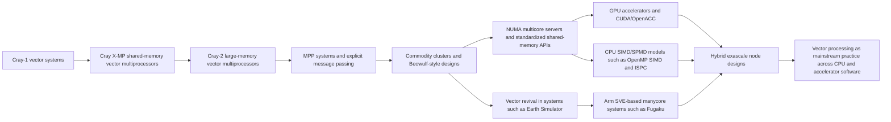

# Publishable Curriculum for the Evolution of Supercomputer Hardware and Code

## Executive summary

This report proposes a 15-week curriculum for advanced undergraduates and graduate students that treats the history of supercomputing as a continuity of abstractions rather than a museum of disconnected machines. The course begins with the vector-first worldview associated with entity["people","Seymour Cray","supercomputer architect"] and with anchor systems such as entity["supercomputer","Cray-1","vector supercomputer introduced in the 1970s"], entity["supercomputer","Cray X-MP","vector multiprocessor supercomputer"], and entity["supercomputer","Cray-2","liquid-cooled vector supercomputer"], then follows the transition through entity["supercomputer","ASCI Red","massively parallel supercomputer"] and commodity clusters to contemporary systems such as entity["supercomputer","Fugaku","Japanese Arm-based supercomputer"], entity["supercomputer","Frontier","exascale supercomputer at OLCF"], entity["supercomputer","Aurora","exascale supercomputer at ALCF"], and entity["supercomputer","El Capitan","exascale supercomputer at LLNL"]. The historical through-line is that vector processing never disappeared: it moved from explicit vector registers and compiler vectorization into SIMD ISAs, SPMD-on-SIMD compilers, and GPU SIMT/throughput machines. citeturn40view1turn40view2turn41view0turn31search17turn7search0turn24view2turn24view1turn24view3turn29search10turn29search19turn13search2

The curriculum is intentionally publishable because it combines four properties that are often separated in HPC teaching: primary-source historical grounding, runnable modern labs, explicit reproducibility infrastructure, and assessments that culminate in a paper-like final project rather than a conventional exam-only finish. Historical weeks rely on original brochures, standards, and seminal papers; modern weeks rely on official programming-model specifications and system pages; labs are runnable on accessible contemporary platforms using urlMPI Forum documentsturn25view0, urlOpenMP specificationsturn27search7, urlOpenACC specificationsturn15search12, urlISPC documentationturn6search2, and urlArm SVE documentationturn16search14. citeturn25view0turn25view1turn25view2turn25view3turn6search2turn16search0turn16search15

The most important analytical choice is to teach architectural change through a stable set of questions: What is the dominant data movement bottleneck? Which parallelism is explicit to the programmer, which is left to the compiler, and which is delegated to libraries or runtime systems? How do local memory, shared memory, distributed memory, and accelerator memory alter code shape? Framed this way, the move from Cray vector loops to MPI halo exchange, OpenMP SIMD, CUDA kernels, OpenACC directives, ISPC lane programming, and Arm SVE vector-length-agnostic code becomes coherent rather than eclectic. citeturn40view3turn25view1turn25view2turn29search10turn29search19turn13search2turn28search0

The recommended delivery model assumes one 90-minute lecture and one 90-minute lab each week, with no dependence on privileged access to national-facility hardware. Historical code is made runnable by preserving semantics and idioms on current compilers; modern code is deployed through a layered laboratory stack built around a CPU/distributed baseline, optional GPU access, and optional Arm and FPGA tracks via emulation, simulation, or cloud nodes. Officially supported options include urlAWS ParallelClusterturn28search11, urlArm Instruction Emulatorturn16search2, urlQEMUturn33search1, urlgem5turn33search0, urlAWS Hpc7g instancesturn17search1, urlNVIDIA HPC SDK containersturn26search5, and urlAMD Vitis HLSturn32search18. citeturn28search11turn28search19turn16search2turn16search9turn34search5turn34search7turn33search0turn17search1turn26search5turn32search18turn32search3

## Course design and learning objectives

### Course framing

The course is built for students who already know systems programming, basic architecture, and at least one compiled language. It assumes comfort with loops, arrays, pointers or indexing, and elementary numerical kernels. Rather than teaching “parallel programming” as a flat map of APIs, it teaches three long-lived ideas: vectorization, decomposition, and data movement. The historical premise is strong: Cray-era vector machines depended on regular loops and aggressive compiler support; the MPP and cluster eras elevated explicit decomposition and communication; contemporary exascale systems reintroduce vector thinking at every level, from SIMD/SVE lanes to GPU warps and accelerator-friendly loop nests. citeturn40view1turn40view2turn41view0turn29search10turn29search19turn13search2turn8search3

The publishable version of the course should therefore ship as a complete educational artifact: syllabus, weekly slides, lab handouts, reference solutions, reproducible container recipes, benchmark datasets, grading rubrics, and a final-project template structured like a short systems paper. This is not only operationally sensible; it also matches the norms of reproducibility now expected in HPC practice and makes the curriculum suitable for archiving in an institutional repository or computing-education venue.

### Learning objectives

By the end of the semester, students should be able to:

- Explain why vector processing became commercially viable on early Cray systems and why compilers were central to that success.
- Analyze how architectural bottlenecks shifted from vector startup and memory-bank behavior to interconnect latency, cache/NUMA locality, and host-device data movement.
- Read and modernize legacy scientific kernels written in Fortran 77/90 and recognize when their structure is favorable to vectorization or parallel decomposition.
- Implement and evaluate small kernels in urlMPIturn25view0, urlOpenMPturn27search7, urlCUDAturn4search2, urlOpenACCturn15search12, urlISPCturn6search2, and Arm SVE intrinsics.
- Distinguish shared-memory, distributed-memory, and heterogeneous node programming and choose models that fit the architecture.
- Interpret compiler optimization reports, simple profiling output, and roofline-style measurements.
- Reproduce a benchmark or mini-app result with documented software versions, input classes, and hardware assumptions.
- Write a final project report that compares architectures or programming models with empirical evidence and a reproducibility appendix.

### Course assumptions and prerequisites

| Item | Assumed setting |
|---|---|
| Audience | Advanced undergraduate or graduate |
| Meeting pattern | One 90-minute lecture + one 90-minute lab per week |
| Mathematical background | Introductory linear algebra and numerical thinking |
| Programming background | C/C++ or Fortran, shell use, version control |
| Systems background | Basic architecture, caches, memory hierarchy, compilation |
| Final deliverable | Reproducible project report with code and benchmarks |

## Comparative architecture, programming, and performance foundations

### Architecture comparison

The architecture spine of the course should be introduced in the first two meetings as a map students will revisit all semester.

| Era | Representative systems | Dominant design idea | Performance characteristic emphasized in class | Typical teaching kernel |
|---|---|---|---|---|
| Late 1970s vector era | Cray-1 | Scalar + vector registers, chaining, regular long loops | Startup cost, stride behavior, vector length, bank conflicts | DAXPY, vector triad |
| Early 1980s vector multiprocessor era | Cray X-MP | Shared-memory vector multiprocessing | Higher memory bandwidth, multiprocessing, auto-chaining | Two-dimensional stencil |
| Mid-1980s large-memory vector era | Cray-2 | Huge shared memory, local memory, liquid immersion cooling | Capacity-driven problem choice, large common memory, overlap | Matrix kernels, out-of-core avoidance |
| Mid-1990s MPP era | ASCI Red | Many nodes, message passing, explicit decomposition | Latency/bandwidth, synchronization, scalability | Jacobi, ping-pong |
| Commodity cluster era | Beowulf clusters | Low-cost distributed Linux clusters | Portability, standard MPI, cluster reproducibility | NAS Parallel Benchmarks |
| Early 2000s vector revival | Earth Simulator | Vector nodes inside a large distributed system | Sustained bandwidth and vector-friendly CFD/climate kernels | Structured grid kernels |
| Modern Arm HPC | Fugaku / A64FX | Wide scalable vectors with high-bandwidth memory | Vector-length-agnostic code, bandwidth-centric optimization | Dot product, stencil |
| Exascale accelerated era | Frontier, Aurora, El Capitan | Hybrid CPU + accelerator nodes, deep memory hierarchy | Communication/computation overlap, kernel offload, node heterogeneity | Mini-app proxy kernels |

The historical data points above are documented in original Cray brochures and papers, NASA and cluster-program sources, and official pages for current systems. The Cray-1 brochure describes 12.5 ns clocks and “over 80 million floating point operations”; the 1983 X-MP brochure describes dual CPUs, over eight times the usable memory bandwidth of the Cray-1, and “over 400 MFLOPS”; the Cray-2 brochure describes four processors, 256 million 64-bit words of common memory, 4.1 ns clocks, and effective throughput six to twelve times that of the Cray-1. citeturn40view1turn40view2turn41view0turn11search2turn11search3turn31search17turn7search0turn24view2turn24view1turn24view3

### Programming-model comparison

| Model | Historical or technical role | What students learn from it | Main pedagogical risk |
|---|---|---|---|
| Fortran 77 + auto-vectorization | The original scientific lingua franca of Cray-era performance | Dependence analysis, stride, long loops, compiler trust | Students may confuse “old syntax” with “obsolete ideas” |
| Cray Fortran directives | Explicit hints for vectorization and multitasking | Safe versus unsafe assertion of independence | Historical syntax is not always runnable natively today |
| MPI | Durable substrate of distributed-memory HPC | Decomposition, halos, collectives, scaling | Students often overfocus on syntax instead of communication pattern |
| OpenMP | Standardized shared-memory and SIMD model | Threading, affinity, reductions, `simd`, target offload | Performance variability across machines |
| BLAS/LAPACK/ScaLAPACK | “Stable interface, moving implementation” lesson | Why libraries outlive hardware generations | Can hide architecture unless profiled explicitly |
| CUDA | Canonical explicit accelerator/SPMD model | Grid/block/thread hierarchy, coalescing, occupancy | Vendor specificity if not contextualized |
| OpenACC | Directive route to accelerator code | Incremental offload and loop annotation | May look “too easy” unless profiling is required |
| ISPC | CPU SIMD via lane-oriented SPMD | GPU-style thinking on CPUs | Students may neglect masks and divergence costs |
| Arm SVE / SVE2 intrinsics | Modern vector-length-agnostic ISA interface | Predication, portable-width vector code | Intrinsics syntax is initially intimidating |
| MPI + X hybrid models | Modern exascale practice | Node-level and cluster-level composition | Debugging and benchmarking complexity |

The standards themselves emphasize this continuity. The official MPI documents page notes MPI 5.0 approval in 2025, while MPICH states that derivatives of its implementation are used on all three exascale systems. OpenMP remains the shared-memory and offload standard; OpenACC remains a directive-based accelerator path; CUDA formalized the SPMD-style GPU model; ISPC explicitly maps SPMD instances to SIMD lanes; and Arm SVE formalizes vector-length-agnostic vector programming. citeturn25view0turn28search0turn25view2turn25view3turn29search10turn29search19turn13search2turn16search15

### Performance-characteristic shifts

| Phase | What limits performance most often | Benchmark or proxy emphasized | Optimization habit students should form |
|---|---|---|---|
| Classic vector machines | Dependence, stride, vector startup | DAXPY, triad, simple stencils | Make loops affine, contiguous, and side-effect-light |
| Vector multiprocessors | Memory bandwidth and task partitioning | Shared-memory stencil | Separate vector parallelism from task parallelism |
| MPP / clusters | Interconnect cost and decomposition quality | Ping-pong, Jacobi, NPB | Move less data, aggregate messages, overlap exchange |
| NUMA multicore | Locality and placement | STREAM + OpenMP | First-touch placement and affinity-aware scheduling |
| GPU accelerators | Coalescing, divergence, transfers | SAXPY, reductions, stencil | Flatten kernels, expose throughput, minimize movement |
| SVE / wide SIMD CPUs | Predication and bandwidth | Dot, triad, sparse gather/scatter | Write VLA kernels and trust masks |
| Exascale hybrid nodes | Kernel fusion, overlap, portability, reproducibility | Mini-apps, Roofline, HPCG | Measure arithmetic intensity and communication together |

These shifts are visible in the official benchmark and system materials: STREAM is explicitly a sustained-memory-bandwidth benchmark; HPCG is explicitly a complement to HPL because dense LINPACK alone cannot represent all important applications; and current exascale system pages foreground node heterogeneity, memory hierarchy, and supported programming models rather than raw peak alone. citeturn38search12turn38search1turn38search6turn24view2turn24view1turn24view3

### Timeline

| Period | Architectural inflection | Curricular meaning |
|---|---|---|
| 1970s | Commercial vector supercomputing becomes practical | Begin with loop structure, not with distributed systems |
| 1980s | Vector multiprocessing and large-memory systems mature | Show how hardware and compiler co-design mattered |
| 1990s | MPP and clusters normalize message passing | Make decomposition and communication explicit |
| 2000s | Clusters dominate, but vector ideas survive in niche high-end systems | Teach continuity rather than replacement |
| 2010s | GPUs and wide SIMD become mainstream | Bridge GPU SPMD and CPU vector lanes |
| 2020s | Exascale systems become hybrid and portability-conscious | End with hybrid MPI + accelerator practice and reproducibility |

The course should explicitly tell students that the timeline is evolutionary, not replacement-driven. The Cray-2 brochure itself already claims that vectorization techniques had become common by the mid-1980s; the Earth Simulator and Fugaku demonstrate that vector-friendly design remained strategically powerful well after the rise of clusters; and contemporary exascale nodes preserve vector logic inside CPUs and accelerators alike. citeturn41view0turn31search17turn7search0turn24view2turn24view1turn24view3

### Architectural evolution flowchart



This flowchart is the intellectual thesis of the curriculum: vector thinking migrates from explicit vector hardware to a broader family of throughput abstractions instead of vanishing. citeturn40view1turn40view2turn41view0turn11search3turn31search17turn29search10turn29search19turn13search2turn24view2turn24view1turn24view3

## Week-by-week syllabus

Before the weekly plan, one instructor note matters: every historical lab should be *runnable*, but not every historical environment should be reconstructed literally. The correct pedagogical target is preservation of programming idiom and performance reasoning. A `cdir$` directive line can still compile as a comment under a modern compiler; a Cray-microtasking example can be paired with a runnable OpenMP translation; an Arm SVE week can run under emulation when hardware is unavailable.

### Opening the vector era

**Week 1.**

**Historical context and key architectures.** Start with the Cray-1 and with the argument that the first decisive breakthrough was not mere clock speed but a usable combination of vector hardware and compiler support. The original brochure describes scalar and vector processing, a 12.5 ns clock, and “over 80 million floating point operations,” while Russell’s CACM paper frames the machine as a coherent system rather than a single datapath trick. citeturn40view1turn29search0

**Programming models and lecture topic.** Lecture centers on Fortran 77, vector registers, chaining, startup latency, and the difference between scalar and vector cost models. Students should leave understanding why long unit-stride loops mattered and why vectorization was fundamentally a *language/compiler* story as much as a hardware story.

**Lab assignment and dataset.** Implement DAXPY and vector triad in Fortran 77 style, sweep array sizes from cache-sized to memory-sized, and compare contiguous versus strided access. Datasets are synthetic and generated at runtime so the class can focus on structure before decomposition.

**Sample code.**
```fortran
      program daxpy_demo
      integer n, i
      parameter (n=1024)
      double precision a, x(n), y(n)

      a = 2.0d0
      do 5 i = 1, n
         x(i) = dble(i)
         y(i) = 1.0d0
 5    continue

      do 10 i = 1, n
         y(i) = y(i) + a * x(i)
 10   continue

      print *, y(1), y(n)
      end
```

**Annotation.** This is the canonical vectorizable kernel: one affine loop, no loop-carried dependence, no indirection, and unit stride.

**Readings.** Required: urlRussell, “The CRAY-1 Computer System”https://dl.acm.org/doi/10.1145/359327.359336; urlCray-1 brochureturn40view1. Recommended: urlThe CRAY-1 brochure page at the Computer History Museumturn30search10.

**Learning outcomes.** Students can explain vector startup cost, unit stride, and dependency-free inner loops.

### Taming dependence for vector compilers

**Week 2.**

**Historical context and key architectures.** This week introduces Cray compiler practice more directly. The CFT77 brochure presents Cray’s compiler as “optimizing, vectorizing, and multitasking,” and emphasizes that standard Fortran programs should run without source modification; later Cray documentation preserves the `IVDEP` family of directives that descend from that culture. citeturn40view3turn19view2

**Programming models and lecture topic.** Lecture topic: dependence analysis, safe assertions, and why directives are promises to the compiler. Students compare implied independence, actual independence, and unsafe optimism.

**Lab assignment and dataset.** Extend Week 1 to use a permutation index array. Compare a direct loop, an indirect loop, and a version annotated with a Cray-style directive. The synthetic dataset is a permutation vector with both safe and intentionally unsafe cases so students can see correctness failures.

**Sample code.**
```fortran
      subroutine perm_axpy(n, a, ind, x, y)
      integer n, i, ind(n)
      double precision a, x(n), y(n)
cdir$ ivdep
      do 20 i = 1, n
         y(ind(i)) = y(ind(i)) + a * x(i)
 20   continue
      return
      end
```

**Annotation.** This is only correct if `ind` has no repeated targets. The entire lesson is that directives are contracts, not suggestions.

**Readings.** Required: urlCFT77 brochureturn40view3; urlHPE Cray Fortran `IVDEP` documentationturn19view2. Recommended: urlThe CRAY-1 brochureturn40view1.

**Learning outcomes.** Students can distinguish aliasing, dependence, and safe directive use.

### Shared-memory vector multiprocessors

**Week 3.**

**Historical context and key architectures.** Move to the Cray X-MP as the point where the vector machine becomes a shared-memory multiprocessor. The 1983 brochure describes two CPUs, more than eight times the usable memory bandwidth of the Cray-1, and explicit software support for multiprocessing and task partitioning; the historical paper on the X-MP gives the design rationale for this move. citeturn40view2turn30search4

**Programming models and lecture topic.** Lecture contrasts vector parallelism with task or processor parallelism. Students learn why “vectorized” and “parallel” are not synonyms, and why a shared memory plus multiple vector processors changes scheduling and decomposition.

**Lab assignment and dataset.** Convert a one-dimensional stencil or array-add kernel into an outer-loop parallel version. Historical syntax is shown first, then translated into a runnable OpenMP equivalent. Dataset: generated arrays and a simple correctness oracle.

**Sample code.**
```fortran
      subroutine addvec(n, a, b, c)
      integer n, i
      double precision a(n), b(n), c(n)
CMIC$ DO ALL VECTOR SHARED(A,B,C,N) PRIVATE(I)
C$OMP PARALLEL DO DEFAULT(SHARED) PRIVATE(I)
      do 30 i = 1, n
         c(i) = a(i) + b(i)
 30   continue
C$OMP END PARALLEL DO
      return
      end
```

**Annotation.** The `CMIC$` line captures the historical idea; the `C$OMP` line is the modern runnable bridge.

**Readings.** Required: urlCray X-MP brochureturn40view2; urlAugust and Brost, “Cray X-MP: The Birth of a Supercomputer”https://doi.org/10.1109/2.19822. Recommended: urlX-MP mainframe reference manual listingturn30search18.

**Learning outcomes.** Students can explain the difference between vectorization and multiprocessing on a shared-memory machine.

### Large-memory vector systems and modern Fortran

**Week 4.**

**Historical context and key architectures.** The Cray-2 week is about balance: the brochure emphasizes four background processors, a giant common memory, local memory, 4.1 ns clocks, liquid immersion cooling, and total memory bandwidth of 64 gigabits or one billion words per second. It also frames the Cray-2 as a system for turning memory-limited problems into CPU-bound ones. citeturn41view0

**Programming models and lecture topic.** Lecture topic: problem size, memory capacity, local versus common memory, and the shift from pure loop tuning toward language constructs that express whole-array intent. This is the natural place to introduce Fortran 90 array syntax and modules.

**Lab assignment and dataset.** Rewrite Week 1 or Week 3 kernels in Fortran 90 style, then test matrix-transpose and blocked matrix-update variants to show when clean array syntax helps and when explicit blocking still matters. Dataset: generated dense matrices.

**Sample code.**
```fortran
module daxpy_mod
contains
  subroutine daxpy(a, x, y)
    real(8), intent(in)    :: a
    real(8), intent(in)    :: x(:)
    real(8), intent(inout) :: y(:)
    y = y + a * x
  end subroutine
end module
```

**Annotation.** The point is not nostalgia. It is that higher-level array expression can preserve vector intent and readability simultaneously.

**Readings.** Required: urlCray-2 brochureturn41view0; urlPerrenod, “The Cray-2: The New Standard in Supercomputing”https://doi.org/10.1007/978-3-642-82908-6_16. Recommended: urlCFT77 brochureturn40view3.

**Learning outcomes.** Students can explain why memory capacity and memory bandwidth can change the *kind* of solvable problem, not just runtime.

### Message passing and the rise of MPP

**Week 5.**

**Historical context and key architectures.** This week pivots from shared memory to explicit distribution. Use ASCI Red as the symbolic MPP landmark and pair it with the Beowulf cluster movement and the original NASA NAS Parallel Benchmarks work. The learning shift is from vector-first thinking to decomposition-first thinking. citeturn11search2turn11search3turn37search0turn37search4

**Programming models and lecture topic.** Lecture topic: domain decomposition, nearest-neighbor exchange, collectives, latency versus bandwidth, and why message passing became the durable interface for distributed memory.

**Lab assignment and dataset.** Implement 1D Jacobi or heat diffusion using MPI, plus a ping-pong microbenchmark. Students run weak and strong scaling on a laptop cluster, campus cluster, or cloud nodes. Dataset: generated domain meshes and small NAS classes where practical.

**Sample code.**
```c
MPI_Irecv(&u[0],       1, MPI_DOUBLE, left,  0, MPI_COMM_WORLD, &req[0]);
MPI_Irecv(&u[n_local-1], 1, MPI_DOUBLE, right, 1, MPI_COMM_WORLD, &req[1]);
MPI_Isend(&u[1],       1, MPI_DOUBLE, left,  1, MPI_COMM_WORLD, &req[2]);
MPI_Isend(&u[n_local-2], 1, MPI_DOUBLE, right, 0, MPI_COMM_WORLD, &req[3]);

for (int i = 1; i < n_local - 1; ++i)
    newu[i] = 0.5 * (u[i-1] + u[i+1]);

MPI_Waitall(4, req, MPI_STATUSES_IGNORE);
```

**Annotation.** The update kernel is trivial; the point is explicit data ownership and halo movement.

**Readings.** Required: urlMPI 4.1 standardturn25view1; urlNAS Parallel Benchmarks siteturn37search0; urlBailey et al., “The NAS Parallel Benchmarks”turn37search12. Recommended: urlBeowulf paper PDFturn11search3.

**Learning outcomes.** Students can decompose a regular domain, implement a halo exchange, and explain why distributed memory changes algorithm structure.

### NUMA and shared-memory standardization

**Week 6.**

**Historical context and key architectures.** After message passing, the course returns to within-node parallelism. This week treats SMP and NUMA systems as the bridge from proprietary shared-memory environments to a standard API, culminating in OpenMP. The performance emphasis is no longer vector startup but placement, coherence, affinity, and memory bandwidth. STREAM is the ideal benchmark because it is explicitly about sustainable main-memory bandwidth. citeturn25view2turn38search12

**Programming models and lecture topic.** Lecture topic: OpenMP execution model, `parallel for`, reductions, `simd`, first-touch allocation, and the difference between “thread count” and “locality quality.”

**Lab assignment and dataset.** Build a STREAM-like triad with OpenMP, initialize arrays using first touch, and compare schedules and thread counts. Dataset: generated vectors sized far beyond last-level cache.

**Sample code.**
```c
#pragma omp parallel for schedule(static)
for (size_t i = 0; i < n; ++i)
    a[i] = 0.0;   /* first-touch placement */

#pragma omp parallel for simd schedule(static)
for (size_t i = 0; i < n; ++i)
    a[i] = b[i] + scalar * c[i];
```

**Annotation.** The first loop is a placement decision masquerading as initialization.

**Readings.** Required: urlOpenMP 5.2 specificationturn25view2; urlSTREAM reference informationturn38search12. Recommended: urlOpenMP specifications indexturn27search3.

**Learning outcomes.** Students can explain NUMA-aware first touch and use `simd` as a conceptual bridge back to vector thinking.

### Libraries as long-lived performance abstractions

**Week 7.**

**Historical context and key architectures.** This week argues that the most durable HPC abstraction is sometimes not a language or API but a library interface. LINPACK originated in Fortran and long predated current machines, yet its benchmark descendants still shape the official Top500 ranking methodology. This is the right week to connect vector supercomputers, tuned BLAS, and modern dense linear algebra practice. citeturn38search10turn38search6

**Programming models and lecture topic.** Lecture topic: BLAS levels, data layout, blocked matrix multiplication, and why “call the tuned library” is itself a historically informed HPC lesson.

**Lab assignment and dataset.** Compare naive matrix multiply against BLAS `DGEMM` and record speedup. Then analyze why a library call survives architectural change better than handwritten loops. Dataset: generated dense matrices of increasing size.

**Sample code.**
```fortran
      call dgemm('N','N', n, n, n,
     &           1.0d0, A, n,
     &                   B, n,
     &           0.0d0, C, n)
```

**Annotation.** One line can hide decades of architecture-specific tuning.

**Readings.** Required: urlLINPACK at Netlibturn38search10; urlThe Linpack Benchmark page at TOP500turn38search6. Recommended: urlWilliams et al., “Roofline: An Insightful Visual Performance Model”https://doi.org/10.1145/1498765.1498785.

**Learning outcomes.** Students can justify when a library interface is better than handwritten code and explain the role of dense linear algebra in supercomputing history.

### GPU manycore and the SPMD turn

**Week 8.**

**Historical context and key architectures.** CUDA is taught here not because current exascale leadership belongs to one vendor, but because CUDA remains the clearest explicit model for accelerator programming and because the original CUDA paper crystallized a scalable SPMD abstraction on throughput hardware. Pedagogically, this is where students realize that GPU programming revives the “many data elements, one kernel shape” logic of classic vector computing in a new form. citeturn29search10turn4search2

**Programming models and lecture topic.** Lecture topic: grid/block/thread hierarchy, occupancy, memory coalescing, divergence, and host-device transfers.

**Lab assignment and dataset.** Implement SAXPY and parallel reduction on a recent GPU. Students benchmark transfer-inclusive and transfer-exclusive timings. GPU access should be departmental or cloud-based; if individual GPU access is unavailable, pair students or provide a CPU-only analysis fallback with provided traces.

**Sample code.**
```cuda
__global__ void saxpy(int n, float a, const float *x, float *y) {
    int i = blockIdx.x * blockDim.x + threadIdx.x;
    if (i < n) y[i] += a * x[i];
}
```

**Annotation.** This is the accelerator analogue of Week 1’s DAXPY: a deliberately simple kernel that isolates the execution model.

**Readings.** Required: urlNickolls et al., “Scalable Parallel Programming with CUDA”https://queue.acm.org/detail.cfm?id=1365500; urlCUDA C++ Programming Guideturn4search2. Recommended: urlCUDA Best Practices Guideturn13search8.

**Learning outcomes.** Students can map a throughput kernel onto blocks and threads and reason about memory coalescing and divergence.

### Directive-based accelerator programming

**Week 9.**

**Historical context and key architectures.** Once students have seen explicit device kernels, the course should show the directive path. OpenACC matters historically because it provides a continuity line from directive-guided vectorization to directive-guided accelerator offload. At the same time, official system pages for contemporary machines emphasize multiple supported models rather than a single language monopoly. citeturn25view3turn24view2turn24view0

**Programming models and lecture topic.** Lecture topic: incremental offload, loop annotation, data regions, and the strategic difference between “kernel-first” and “directive-first” porting.

**Lab assignment and dataset.** Port a SAXPY or 2D stencil to OpenACC. If the class has access to a GPU-capable compiler, students execute on device; if not, they use compiler feedback and compare generated reports against the CPU baseline. miniWeather is an excellent optional mini-app because it was explicitly built for training accelerated-HPC parallelization. citeturn36search17

**Sample code.**
```c
#pragma acc data copyin(x[0:n]) copy(y[0:n])
#pragma acc parallel loop
for (int i = 0; i < n; ++i)
    y[i] += a * x[i];
```

**Annotation.** The code forces discussion of how much of an accelerator port belongs in loop annotations and how much belongs in data lifetime management.

**Readings.** Required: urlOpenACC 3.4 specificationturn25view3; urlminiWeather code record at OSTIturn36search17. Recommended: urlFrontier programming models pageturn24view2.

**Learning outcomes.** Students can use directives to control implementation without discarding a readable serial loop structure.

### CPU SIMD as SPMD

**Week 10.**

**Historical context and key architectures.** ISPC is the clearest curricular bridge between GPU-like SPMD thinking and CPU SIMD execution. The ISPC paper explicitly states that its model maps program instances onto SIMD lanes and that it draws from GPU programming languages. This is exactly the conceptual bridge the course wants students to cross. citeturn29search19turn29search7

**Programming models and lecture topic.** Lecture topic: lanes, masks, gather/scatter, `foreach`, gang versus lane thinking, and why “CPU vectorization” can be taught with a GPU mental model.

**Lab assignment and dataset.** Implement SAXPY or masked thresholding in ISPC, then compare to scalar C and OpenMP SIMD. For a more advanced variant, students apply ISPC gather/scatter to a sparse or irregular kernel using a small matrix from SuiteSparse or Matrix Market. citeturn36search3turn38search15

**Sample code.**
```ispc
export void saxpy(uniform float a,
                  uniform float x[],
                  uniform float y[],
                  uniform int n) {
    foreach (i = 0 ... n) {
        y[i] += a * x[i];
    }
}
```

**Annotation.** The SPMD syntax exposes lane-level parallelism without forcing students immediately into ISA intrinsics.

**Readings.** Required: urlISPC documentationturn6search2; urlPharr and Mark, “A SPMD Compiler for High-Performance CPU Programming”https://llvm.org/pubs/2012-05-13-InPar-ispc.html. Recommended: urlISPC project siteturn6search4.

**Learning outcomes.** Students can explain how SPMD-on-SIMD differs from classic compiler auto-vectorization.

### Vector-length-agnostic Arm programming

**Week 11.**

**Historical context and key architectures.** This week returns the course explicitly to vector hardware, but on modern terms. Arm’s Scalable Vector Extension was designed for vector-length-agnostic programming, and Fugaku’s A64FX made that model a first-class HPC teaching target. The SVE paper emphasizes VLA design; the official Arm guides explain SVE and SVE2 programming; and official Fugaku materials show the scale of an Arm-based supercomputer built around SVE-enabled CPUs. citeturn13search2turn16search0turn16search15turn7search0

**Programming models and lecture topic.** Lecture topic: predicates, `whilelt`, vector-length agnosticism, scalable-width portability, and optional SVE2 extensions. Students should see how this revives vector thinking while avoiding hard-coded lane counts.

**Lab assignment and dataset.** Implement DAXPY or dot product with SVE intrinsics. If real SVE hardware is unavailable, use ArmIE or QEMU; for real hardware, AWS Hpc7g/Graviton3E is the most accessible official route in the retrieved materials. An optional SVE2 exercise can use byte-level or image-style kernels under emulation. citeturn16search2turn16search9turn34search5turn34search7turn17search1

**Sample code.**
```c
#include <arm_sve.h>

void daxpy_sve(size_t n, double a, const double *x, double *y) {
    for (size_t i = 0; i < n; i += svcntd()) {
        svbool_t pg = svwhilelt_b64(i, n);
        svfloat64_t xv = svld1(pg, &x[i]);
        svfloat64_t yv = svld1(pg, &y[i]);
        svfloat64_t zv = svmul_n_f64_x(pg, xv, a);
        svst1(pg, &y[i], svadd_f64_m(pg, yv, zv));
    }
}
```

**Annotation.** No lane count appears in the loop body. That is the lesson.

**Readings.** Required: urlStephens et al., “The Arm Scalable Vector Extension”https://doi.org/10.1109/MM.2017.35; urlArm SVE guideturn16search14; urlArm SVE2 guideturn16search15. Recommended: urlFugaku system overviewturn7search0.

**Learning outcomes.** Students can write vector-length-agnostic code and explain predication as a modern vector abstraction.

### Exascale nodes and hybrid programming

**Week 12.**

**Historical context and key architectures.** This is the synthesis week for present-day machine design. The official Frontier page describes an exascale system with one CPU and four GPUs per node and a broad set of supported models; Aurora emphasizes Intel GPUs, multi-rail networking, and oneAPI/OpenMP support; El Capitan emphasizes its balanced CPU/GPU/APU design and system scale. In the retrieved June 2025 TOP500 materials, El Capitan, Frontier, and Aurora are the exascale landmarks. citeturn24view2turn24view1turn24view3turn8search3

**Programming models and lecture topic.** Lecture topic: hybrid decomposition, MPI between nodes, threaded or offloaded kernels within node, portability layers, and why no single API now suffices for all exascale environments.

**Lab assignment and dataset.** Hybridize the Week 5 stencil: MPI for domain decomposition, and OpenMP target or CUDA/OpenACC for the local update, depending on available hardware. Dataset: larger generated stencil domains or a mini-app kernel extracted from miniWeather or LULESH. citeturn36search17turn36search1

**Sample code.**
```c
/* MPI exchanges happen outside this kernel. */
#pragma omp target teams distribute parallel for \
    map(to:u[0:n]) map(from:newu[0:n])
for (int i = 1; i < n - 1; ++i)
    newu[i] = 0.5 * (u[i-1] + u[i+1]);
```

**Annotation.** The code is intentionally partial: the important lesson is composition of node-level and cluster-level parallelism.

**Readings.** Required: urlFrontier system pageturn24view2; urlAurora system overviewturn24view1; urlEl Capitan platform pageturn24view3. Recommended: urlTOP500 June 2025 list pageturn8search3.

**Learning outcomes.** Students can explain why exascale programming is inherently hybrid and why performance claims must include data movement and portability assumptions.

### Reconfigurable acceleration

**Week 13.**

**Historical context and key architectures.** This week widens the course beyond CPU/GPU dualism. Cloud FPGA instances and HLS tools now let instructors expose a streaming/dataflow model without a dedicated on-prem FPGA lab. AWS F2 is explicitly positioned as second-generation FPGA-powered cloud hardware, and AMD’s Vitis HLS explicitly compiles C/C++ into RTL or accelerator kernels. citeturn32search3turn32search18

**Programming models and lecture topic.** Lecture topic: dataflow, initiation interval, throughput pipelines, host-device orchestration, and how FPGA thinking differs from SIMD/SIMT.

**Lab assignment and dataset.** Make this an optional or alternate-track lab. Use Vitis HLS software emulation or AWS F2/F1 development kits where available. Students implement vector add or a streaming FIR/stencil kernel, then compare the optimization vocabulary against CUDA and OpenMP. Dataset: synthetic arrays or coefficient files.

**Sample code.**
```cpp
void vadd(const float *a, const float *b, float *c, int n) {
  for (int i = 0; i < n; ++i) {
#pragma HLS PIPELINE II=1
    c[i] = a[i] + b[i];
  }
}
```

**Annotation.** The pedagogical value is the shift from thread/block reasoning to pipeline and initiation-interval reasoning.

**Readings.** Required: urlAWS F2 instances overviewturn32search3; urlAMD Vitis HLS overviewturn32search18. Recommended: urlAWS FPGA development kit repositoryturn32search11.

**Learning outcomes.** Students can explain how streaming/dataflow acceleration differs from thread-oriented parallel programming.

### Modeling and measurement

**Week 14.**

**Historical context and key architectures.** By this stage, students have seen enough architectures to need a unifying analysis framework. Roofline is the best one-semester tool because it makes arithmetic intensity and bandwidth central without overcommitting to any single machine. STREAM and HPCG then illustrate why memory and communication matter alongside peak FLOPS. citeturn14search4turn38search12turn38search1turn38search9

**Programming models and lecture topic.** Lecture topic: operational intensity, cache-aware versus bandwidth-bound regimes, profiling, timing hygiene, and why benchmark methodology must be documented as carefully as code.

**Lab assignment and dataset.** Measure Week 1, Week 6, Week 8, Week 10, or Week 11 kernels; estimate bytes moved and FLOPs; place them on a roofline sketch; and compare predicted versus observed behavior. Dataset: generated arrays, STREAM-sized problems, and optionally HPCG or NPB classes.

**Sample code.**
```c
double bytes = 3.0 * n * sizeof(double);   /* triad: read b,c and write a */
double flops = 2.0 * n;                    /* multiply + add */
double intensity = flops / bytes;
printf("Arithmetic intensity = %.6f flop/byte\n", intensity);
```

**Annotation.** The code is deliberately tiny because the week is about *measurement discipline*, not API novelty.

**Readings.** Required: urlWilliams et al., “Roofline: An Insightful Visual Performance Model”https://doi.org/10.1145/1498765.1498785; urlSTREAM reference informationturn38search12; urlHPCG benchmark projectturn38search1. Recommended: urlOfficial HPCG source codeturn38search9.

**Learning outcomes.** Students can classify kernels by arithmetic intensity and defend a measurement methodology.

### Synthesis and final presentations

**Week 15.**

**Historical context and key architectures.** The final week is for synthesis, not for new content. Students now revisit the claim from the Cray-2 brochure that vectorization techniques had become common, then test whether that claim remains true in a world of SVE, ISPC, GPU kernels, and exascale hybrid nodes. The answer should be yes, with nuance: vector processing is now mainstream, but it is mediated by more layers of software and more kinds of memory than in the 1980s. citeturn41view0turn29search19turn13search2turn24view2turn24view1turn24view3

**Programming models and lecture topic.** Lecture topic: historical synthesis, portability versus peak, final-project design critique, and reproducibility review.

**Lab assignment and dataset.** Students present final project prototypes, reproduce at least one baseline result, and submit a paper-like draft with method, results, limitations, and artifact appendix.

**Sample code.**
```python
import csv, subprocess

bins = ["f77_daxpy", "mpi_jacobi", "omp_stream"]
with open("results.csv", "w", newline="") as f:
    w = csv.writer(f)
    w.writerow(["binary", "result"])
    for exe in bins:
        out = subprocess.check_output([f"./{exe}"], text=True).strip()
        w.writerow([exe, out])
```

**Annotation.** Final-week code is not about a new architecture; it is about turning performance work into a reproducible artifact.

**Readings.** Required: urlTOP500 project pagesturn8search3; urlMPI Forum documentsturn25view0. Recommended: students reread their primary sources from Weeks 1, 3, 4, 8, 11, and 12 and explicitly connect them in the final report.

**Learning outcomes.** Students can synthesize the whole arc of the course and defend a final empirical comparison.

## Assessment, projects, resources, and instructor notes

### Assessment plan

A rigorous and publishable course should grade both reasoning and reproducibility.

| Component | Weight | Purpose |
|---|---:|---|
| Weekly lab submissions | 35% | Code correctness, benchmarking discipline, short interpretation |
| Reading memos | 10% | Demonstrate direct engagement with primary/official sources |
| Architecture comparison essay | 10% | Historical analysis after Week 4 or Week 5 |
| Midterm take-home analysis | 15% | Performance reasoning across vector, shared-memory, and MPI eras |
| Final project proposal | 5% | Enforce early scope control and artifact planning |
| Final project report + presentation | 25% | Empirical comparison plus reproducibility appendix |

The grading rubric should reward measured claims rather than raw speed. Students should not be punished for lacking top-tier hardware if their methodology, controls, and analysis are sound. The final project report should explicitly separate correctness, performance, portability, and reproducibility results.

### Project portfolio

Strong final projects are comparative, historically aware, and explicit about data movement.

| Project theme | Core comparison | Suggested datasets or mini-apps |
|---|---|---|
| Vector then and now | Fortran 77 loop, OpenMP SIMD, ISPC, SVE | Synthetic DAXPY/triad |
| From Cray loop to exascale kernel | Cray-style stencil to MPI + target offload | Generated stencil grids, NPB |
| Bandwidth archaeology | STREAM on x86, Arm SVE, GPU | STREAM-sized synthetic arrays |
| Sparse irregularity across models | Scalar C, OpenMP, ISPC gather/scatter, MPI | SuiteSparse / Matrix Market |
| Climate mini-app path | MPI only, OpenACC, OpenMP target | miniWeather |
| Dense linear algebra longevity | Naive loops vs BLAS and node-level offload | Generated dense matrices |
| Reconfigurable alternative | CPU/GPU kernel vs HLS pipeline | Synthetic vector or FIR workloads |
| Profiling and roofline study | Same kernel on two architectures with measured intensity | STREAM, HPCG, NPB |

The most publishable projects are those that include a small but careful historical framing section. For example, a project that begins with a Cray-era DAXPY loop and ends with SVE or CUDA results can make a strong, concrete argument about abstraction continuity.

### Lab software and hardware stack

A practical stack should be layered, not monolithic.

| Layer | Recommended resources | Role in the course |
|---|---|---|
| Baseline CPU stack | gfortran / GCC / Clang, system BLAS, Python, `make` | Weeks 1–7 and final benchmarking |
| Distributed-memory stack | `mpicc` or `mpifort` with MPICH or campus MPI | Weeks 5, 7, 12, 15 |
| GPU stack | NVHPC or CUDA-capable environment, optional OpenACC compiler | Weeks 8, 9, 12 |
| Arm vector stack | ArmIE, QEMU, real Arm SVE nodes such as Hpc7g | Week 11 |
| Architecture simulation | gem5, QEMU | Supplemental exploration and inaccessible-hardware fallback |
| FPGA stack | Vitis HLS, optional AWS F2/F1 workflows | Week 13 optional track |
| Containers | Instructor-maintained CPU image + official GPU image | Reproducibility and student setup simplification |

A high-confidence lab stack can be built around official resources: urlMPICH at Argonneturn28search12 for a portable MPI implementation; urlNVIDIA HPC SDK containersturn26search5 for GPU and OpenACC work; urlArm Instruction Emulatorturn16search2 and urlQEMU Arm documentationturn34search12 for Arm/SVE access; urlAWS Hpc7g instancesturn17search1 for real Graviton3E SVE hardware; urlgem5turn33search0 for architecture teaching and experimentation; and urlAWS ParallelClusterturn28search11 for a cloud MPI/Slurm teaching cluster. citeturn28search12turn26search5turn16search2turn16search9turn34search12turn17search1turn33search0turn28search11turn28search19

### Datasets and benchmark sources

Prefer small, official, and well-documented sources.

| Dataset or source | Why it belongs |
|---|---|
| Synthetic vectors and matrices | Essential for isolating vector and bandwidth behavior |
| NAS Parallel Benchmarks | Standardized small kernels and pseudo-apps derived from CFD |
| STREAM | Memory-bandwidth baseline and roofline input |
| HPCG | Memory- and communication-sensitive complement to HPL |
| LINPACK / BLAS test cases | Dense linear algebra continuity |
| SuiteSparse Matrix Collection / Matrix Market | Sparse irregular kernels |
| miniWeather | Training mini-app for accelerated HPC |
| LULESH | Widely used proxy application for structured performance studies |

Official descriptions for these sources are available from NASA, the University of Virginia STREAM site, the HPCG project, Netlib/TOP500, SuiteSparse, Matrix Market, OSTI, and LLNL. citeturn37search0turn37search12turn38search12turn38search1turn38search9turn38search10turn38search6turn36search3turn38search15turn36search17turn36search1

### Licensing, accessibility, and operational notes

**Licensing.** Favor standards and open or low-friction tools where possible. ISPC is explicitly BSD-licensed; AWS ParallelCluster is explicitly open source; ArmIE is explicitly available with no license required; NVIDIA’s HPC SDK is a free download governed by a software license agreement; and Vitis HLS documentation explicitly calls out licensing, so it should be treated as an optional or centrally managed dependency rather than a universal student requirement. citeturn28search16turn28search11turn16search9turn15search5turn32search9

**Accessibility.** The course should treat accessibility as part of reproducibility. All slides should have text equivalents; all recorded demos should have captions and transcripts; code should be distributed as plain text rather than screenshots; and visual materials should be checked against WCAG guidance for text alternatives and contrast. These are not merely compliance niceties; they materially improve pedagogy in a course dense with diagrams and terminal workflows. citeturn39search0turn39search1turn39search4turn39search14turn39search18

**Operational notes.** Every accelerator lab should have a CPU-only analysis fallback. Every result submission should include compiler version, flags, hardware note, input size, and timing method. Instructor-provided makefiles and container recipes should be frozen per assignment to keep grading fair. Historical weeks should grade reasoning about architecture-model fit, not just runtime.

**Open questions and limitations.** Full-system emulation of original Cray user environments is not the design center of this curriculum. That choice is intentional, but it means the course teaches historical semantics and performance reasoning more faithfully than it recreates original operating environments. FPGA access and real SVE hardware access will also vary by institution, so Weeks 11 and 13 should be designed with emulation and optionality in mind.

## Primary-source bibliography and publication package

### Core primary-source packet

Historical systems:

- urlRussell, “The CRAY-1 Computer System”https://dl.acm.org/doi/10.1145/359327.359336
- urlCray-1 brochureturn40view1
- urlCray X-MP brochureturn40view2
- urlAugust and Brost, “Cray X-MP: The Birth of a Supercomputer”https://doi.org/10.1109/2.19822
- urlCray-2 brochureturn41view0
- urlPerrenod, “The Cray-2: The New Standard in Supercomputing”https://doi.org/10.1007/978-3-642-82908-6_16
- urlCFT77 brochureturn40view3

Distributed-memory and benchmark sources:

- urlMPI documents indexturn25view0
- urlMPI 4.1 standardturn25view1
- urlNAS Parallel Benchmarks siteturn37search0
- urlBailey et al., “The NAS Parallel Benchmarks”turn37search12
- urlBeowulf paper PDFturn11search3
- urlSTREAM reference informationturn38search12
- urlHPCG benchmark projectturn38search1
- urlLINPACK at Netlibturn38search10
- urlTOP500 Linpack project pageturn38search6

Programming-model standards and papers:

- urlOpenMP 5.2 specificationturn25view2
- urlOpenACC 3.4 specificationturn25view3
- urlNickolls et al., “Scalable Parallel Programming with CUDA”https://queue.acm.org/detail.cfm?id=1365500
- urlCUDA C++ Programming Guideturn4search2
- urlISPC documentationturn6search2
- urlPharr and Mark, “A SPMD Compiler for High-Performance CPU Programming”https://llvm.org/pubs/2012-05-13-InPar-ispc.html
- urlStephens et al., “The Arm Scalable Vector Extension”https://doi.org/10.1109/MM.2017.35
- urlArm SVE guideturn16search14
- urlArm SVE2 guideturn16search15

Modern system pages:

- urlFugaku system overviewturn7search0
- urlFrontier system pageturn24view2
- urlAurora system overviewturn24view1
- urlEl Capitan platform pageturn24view3
- urlTOP500 June 2025 list pageturn8search3

Lab infrastructure and datasets:

- urlMPICH at Argonneturn28search12
- urlAWS ParallelClusterturn28search11
- urlArm Instruction Emulatorturn16search2
- urlQEMU documentationturn34search10
- urlgem5 project siteturn33search0
- urlAWS Hpc7g instancesturn17search1
- urlNVIDIA HPC SDK containersturn26search5
- urlAMD Vitis HLS overviewturn32search18
- urlAWS F2 instancesturn32search3
- urlSuiteSparse Matrix Collectionturn36search3
- urlMatrix Market backgroundturn38search15
- urlminiWeather code recordturn36search17
- urlLULESH repositoryturn36search1

### Recommended secondary packet

A shorter, non-primary supplementary packet should include one modern architecture text, one performance-analysis text, and one compiler/vectorization text, chosen by the instructor based on local background. The course does not *require* a conventional textbook if the primary packet is used seriously.

### Publishable course artifacts

To make the curriculum publication-ready, the instructor should package:

- A versioned syllabus and weekly schedule.
- Slide decks with captions/transcripts or text alternatives.
- Lab handouts with expected outputs and timing methodology.
- Instructor-tested code for CPU, MPI, GPU, Arm, and optional FPGA paths.
- Container recipes and environment manifests.
- A grading rubric keyed to learning objectives.
- A final-project template with abstract, method, results, threat-to-validity, and reproducibility appendix sections.
- A short reflective memo explaining how historical primary sources are paired with runnable modern environments.

That package is robust enough to support local adoption, reproducible teaching, and publication as a serious curriculum contribution rather than a one-off teaching note.